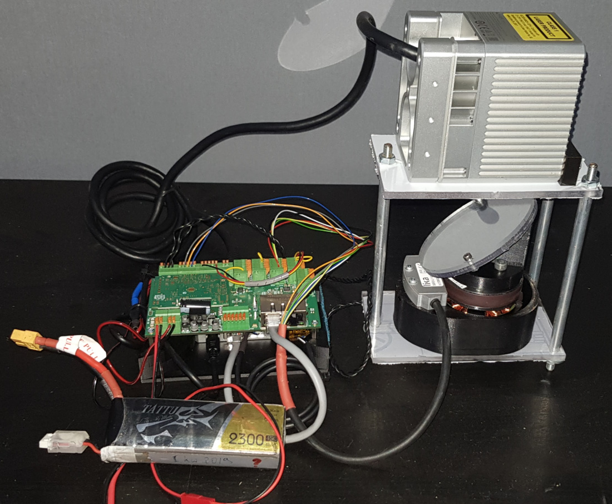

# Lidar spinning mirror

## Repository goal
At this moment repository contains C++ code with an optimizer that optimizes the geometry 
of the Livox Mid-40 LiDAR's field of view. The prototype of the device allows spinning a 
reflector with a speed from 1RPM to 120RPM. The device has time synchronization that enables 
precise measurement. With a presented method of calibration, a fresh approach for LiDAR's FOV 

## Demo 5 RPM

[Download pcd, 5 RPM](https://storage.googleapis.com/dataset_sensors_pub/pcd_samples/railway_slow.pcd)

## Demo 120 RPM

[Download pcd, 120 RPM](https://storage.googleapis.com/dataset_sensors_pub/pcd_samples/parking_fast_1sec.pcd)
[Download pcd, 5 RPM](https://storage.googleapis.com/dataset_sensors_pub/pcd_samples/parking_fast_1sec.pcd)

# Mechanical design 

The system is built with a tilted reflector that spins. The angle is read by a contactless encoder.
An electronic PCB produces a synchronization signal for Livox Mid-40.

## Plans
 - Develop an open hardware version of the calibrated system using more available components (e.g. classic encoder and DC motor and widely available STM32 board )
 - Release firmware and ROS-node
